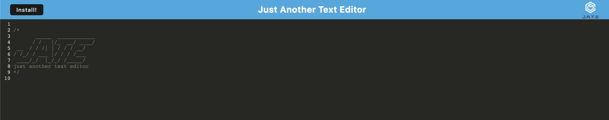

# pwa-text-editor

## Technology Used 

| Technology Used         | Resource URL           | 
| ------------- |:-------------:| 
| Git | [https://git-scm.com/](https://git-scm.com/)     | 
| Node.js | [https://nodejs.org/api/cli.html](https://nodejs.org/api/cli.html)   |
| NPM | [https://www.npmjs.com/](https://www.npmjs.com/)   |
| Heroku | [https://mongoosejs.com/](https://mongoosejs.com/)   |
| IDB | [https://www.npmjs.com/package/idb](https://www.npmjs.com/package/idb)   |


## Description 

Deployed Link []

This program is a text editor so users can enter thier notes and code snippets that could be used for later. This program can also be accesed and be fully functional without an internet conncetion allowing users to work offline as well.


## Table of Contents 

* [Javascript Example](#javascript-example)
* [Usage](#usage)
* [Learning Points](#learning-points)
* [Author Info](#author-info)


## Javascript Example

To get a hold of this project, simply navigate to my Github profile and select the repo "pwa-text-editor". From there copy the SSH link into your terminal, Gitbash, or whatever application you prefer and use git copy and then paste the link or simply navigate to the deployed link from Heroku.


```javascript
  export const putDb = async (content) => {
console.log('PUT to the database');
  const jateDb = await openDB('jate', 1);
  const tx = jateDb.transaction('jate', 'readwrite');
  const store = tx.objectStore('jate');
  const request = store.put({ id: 1, value: content});

const result = await request;
console.log('🚀 - data saved to the database', result);
return result;
};

```

The above code allows for any content written by the user to then be saved into the jate database.

```javascript

registerRoute(
  ({ request }) => ['style', 'script', 'worker'].includes(request.destination),
  new StaleWhileRevalidate({
    cacheName: 'asset-cache',
    plugins: [
      new CacheableResponsePlugin({
        statuses: [0, 200],
      }),
    ],
  })
);
  
```

This code is using workbox for assest caching so the program can work without a internet connection.


## Usage 
To use the social network API, you must first acquire it through GitHub, see above how to do this. After you open it in VS Code, you may then use your computer's terminal or the terminal in VS Code. Make sure you are inside this repository in the terminal, and run `npm run install` and then `npm run start` or use the deployed Heroku link. You can then begin typing your notes or code snippets. You may also click the install button to download this program to your desktop and it may be used while offline as well.


</br>


## Learning Points 


Through this project, I got more experience using IDB, creating scripts and making PWAs. 

## Author Info


### Sam Higa 


* [Portfolio](https://samhiga.github.io/my-portfolio/)
* [LinkedIn](https://www.linkedin.com/in/sam-higa-b887b9209/)
* [Github](https://github.com/samhiga)